<div align="center">

# NEON ROADS

**Ride the floating highways. Survive the void.**

A neon-retro, floating-highway racer that runs in your browser.<br>
It's a tribute to **SkyRoads**, the 1993 DOS classic by BlueMoon Software.

[](https://github.com/abhas9/neon-roads/actions/workflows/deploy.yml)
[](LICENSE)
[](https://threejs.org)

### [▶ Play now at abhas9.github.io/neon-roads](https://abhas9.github.io/neon-roads/)

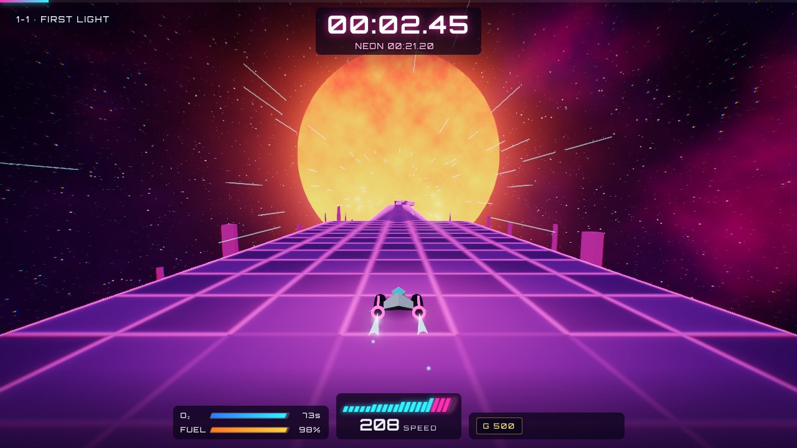

</div>

---

## Table of contents

- [About](#about)
- [A tribute to SkyRoads](#a-tribute-to-skyroads)
- [Features](#features)
- [Screenshots](#screenshots)
- [How to play](#how-to-play)
- [Holographic ghost ship](#holographic-ghost-ship)
- [Victory celebration and Share on X](#victory-celebration-and-share-on-x)
- [Use your phone as a controller](#use-your-phone-as-a-controller)
- [Wand controller: steer with a webcam](#wand-controller-steer-with-a-webcam)
- [Run locally](#run-locally)
- [Deploy to GitHub Pages](#deploy-to-github-pages)
- [Project structure](#project-structure)
- [Authoring roads](#authoring-roads)
- [Testing and verification](#testing-and-verification)
- [Credits](#credits)
- [License](#license)

## About

Neon Roads is an arcade platform-racer. You pilot a small hover ship along roads suspended in space: seven lanes of tiles, blocks, tunnels and gaps. Oxygen drains every second, fuel burns with every metre, and gravity changes from road to road. Reach the gate at the end before you run out of air.

It is built with [three.js](https://threejs.org) and TypeScript and runs entirely in the browser: no install, no accounts, no server. Every level, model, texture and piece of music in this repository is original. The visuals are procedural shaders and the soundtrack is generated live with the Web Audio API.

## A tribute to SkyRoads

Neon Roads exists because of **[SkyRoads](https://en.wikipedia.org/wiki/SkyRoads_(video_game))** (1993), developed by **BlueMoon Software** in Estonia. SkyRoads was a remake of BlueMoon's earlier game **Kosmonaut** (1990). Released as shareware, it became an international hit in the DOS era and was followed by the *SkyRoads X-Mas Special* in 1994.

What made it special, and what this project tries to honour:

- **Instant clarity.** Steer, throttle and jump; the colour of a tile tells you what it does.
- **Depth from combinations.** Gravity, oxygen, fuel, tile types and road geometry mix into roads that each feel like a different puzzle: some are sprints against the clock, some are precision tests, some are resource puzzles.
- **The one-more-try loop.** Roads are short, failure is instant, and restarting is immediate.
- **A real sense of speed** on the hardware of its day.

Neon Roads keeps those ideas and adds modern touches: medals and ghost replays, procedurally generated endless and daily roads, a neon presentation, accessibility cues, and phone-as-controller support.

> **Disclaimer.** Neon Roads is an independent, non-commercial fan tribute. It is not affiliated with, endorsed by or connected to BlueMoon Software, the SkyRoads rights holders or any publisher of the original game. "SkyRoads" and "Kosmonaut" are the property of their respective owners and are mentioned only to credit the inspiration. No code, graphics, audio or level data from the original games is used. All roads were designed from scratch, informed by public descriptions of the original's mechanics and by watching gameplay.

If you have never played the original, it is well worth seeking out. Fan-made editors and remakes are still being created decades later.

## Features

### The classic formula

- **The road:** a seven-lane grid of floor tiles, half and full-height blocks, tunnels, tunnels cut through blocks, and gaps to jump.
- **Tile effects:**

  | Tile | Effect |
  |---|---|
  | **Supply** (blue, plus sign) | Refills oxygen and fuel |
  | **Boost** (green, chevrons) | Rapid acceleration |
  | **Sticky** (olive, dots) | Heavy drag |
  | **Slippery** (silver, stripes) | No steering |
  | **Burning** (red, hazard stripes) | Instant destruction |

- **Oxygen** is the clock, **fuel** burns with distance, and **gravity** ranges from floaty (G 100) to crushing (G 1700).
- **Ways to die:** hitting a wall head-on at speed, falling into the void, or running out of air or fuel.
- **Campaign:** 10 worlds × 3 roads = 30 handcrafted roads, each world introducing its own twist.
- Unlimited retries with instant restart.

### What's new

- 🏅 **Medals:** Bronze, Silver, Gold and the elusive **Neon**, measured against par times.
- 👻 **Holographic ghost ship:** your fastest run on every road is recorded automatically and replayed as a glowing hologram you can race.
  - **Toggle:** `G`, the pause menu, Settings, or 👻 on the phone pad.
  - **Details:** see [Holographic ghost ship](#holographic-ghost-ship).
- 🎆 **Victory celebration:** clearing a road sets off fireworks at the finish gate while the camera circles it. The show keeps going behind the results screen, and a medal adds a finale salvo.
- 𝕏 **Share on X:** one click copies an ASCII scorecard to your clipboard and opens a ready-made post with your time, medal, fuel, oxygen, top speed and a link to the game.
- ♾️ **Endless mode:** a procedurally generated road that gets harder the further you go, with gravity sectors that shift under you.
- 📅 **Daily Run:** the same generated road for everyone on a given day, with a ghost of your best attempt.
- 🚀 **Boost overdrive:** boost pads push you past top speed, which makes boost-then-jump a skill of its own.
- 📱 **Phone as controller:** scan a QR code and your phone becomes a wireless gamepad over peer-to-peer WebRTC.
- 🪄 **Wand controller (experimental):** print a two-colour marker, tape it to a pen, and steer with your webcam — tilt to turn, push to accelerate, flick to jump. All tracking happens in the page; no video leaves your device. See [Wand controller](#wand-controller-steer-with-a-webcam).
- 🎮 **Input:** keyboard (with analog steering ramp), gamepad (analog stick and triggers), and on-screen touch controls.
- 👓 **Readable over any world:** every screen passes a WCAG AA contrast audit. Menu, HUD and label text sits on frosted backplates, so it stays legible over bright suns, moons and floors.
- ♿ **Colour-independent tiles:** every special tile also has an animated pattern (plus sign, chevrons, dots, stripes, hazard bars), so you don't need to tell colours apart. Also optional jump assist and a reduced-motion setting.
- 🌌 **Ten procedural skies:** synthwave suns, ringed planets, moons, a lensing black hole and more. Plus bloom, glowing edges, speed lines, shattering explosions and landing squash.
- 🎵 **Generated soundtrack:** a different theme per world, plus synthesized effects and an engine hum that follows your speed. There are no audio files.
- ✅ **Every road is proven beatable:** a beam-search bot plays all 30 roads without jump assist before release, and its times set the medal targets.

## Screenshots

| | |
|:---:|:---:|
| 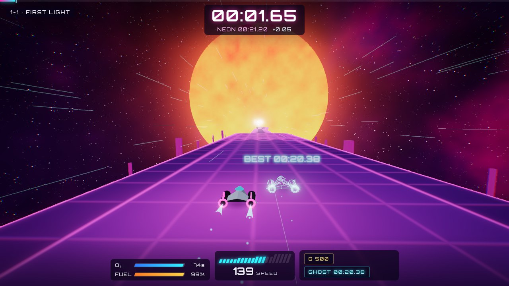 | 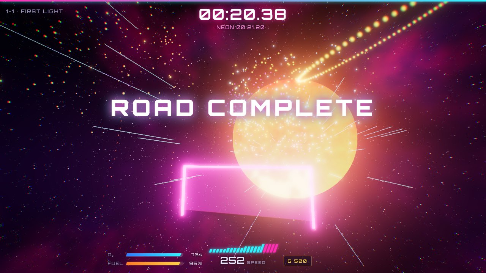 |
| **Race your holographic ghost** | **Victory fireworks at the finish gate** |
| 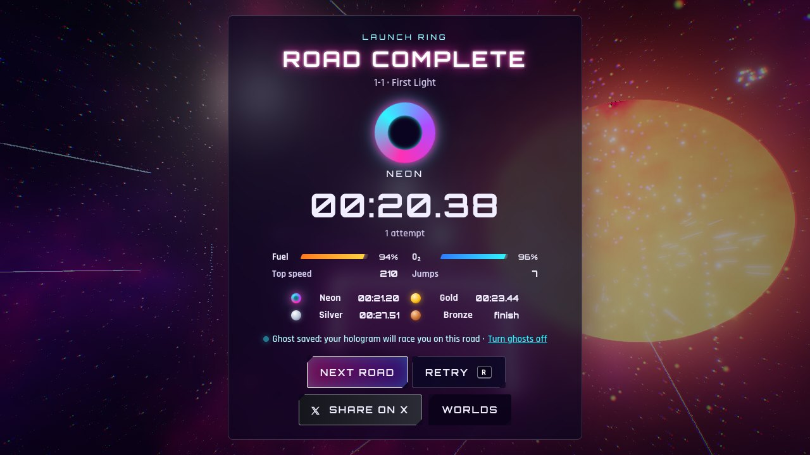 | 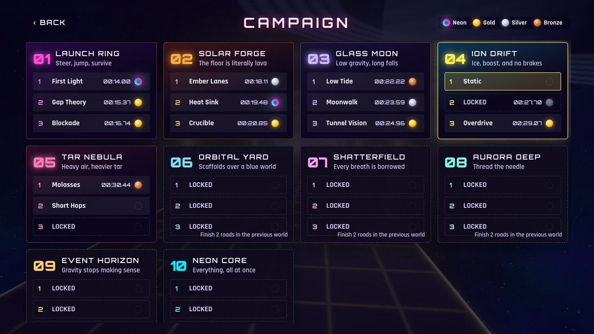 |
| **Results, stats and Share on X** | **Campaign: 10 worlds, 30 roads, medals** |
| 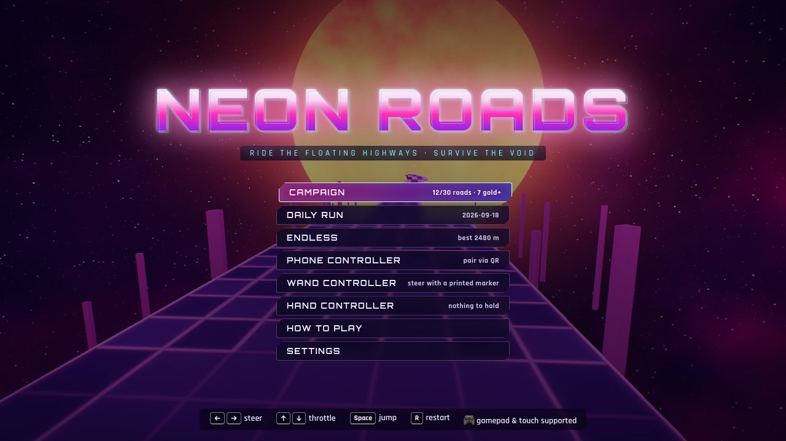 | 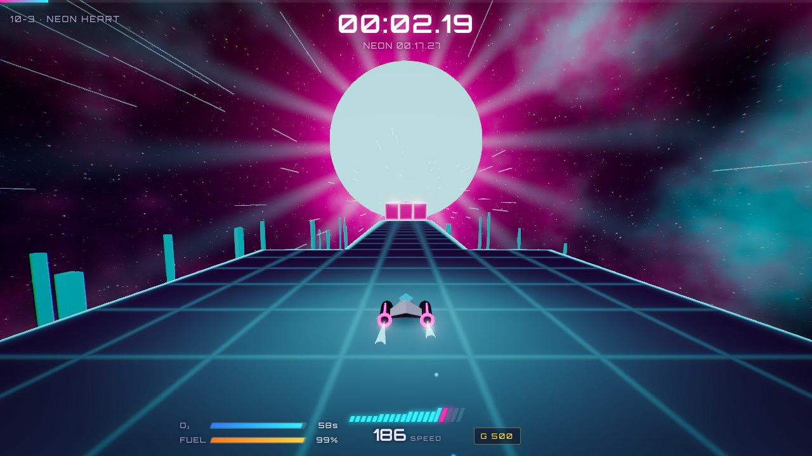 |
| **Title screen** | **Neon Core: everything, all at once** |
| 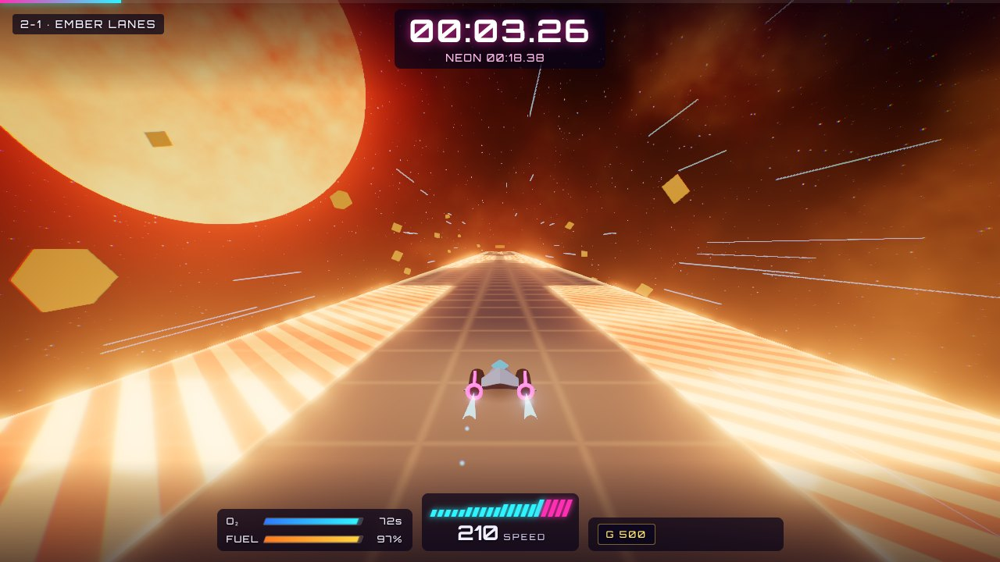 | 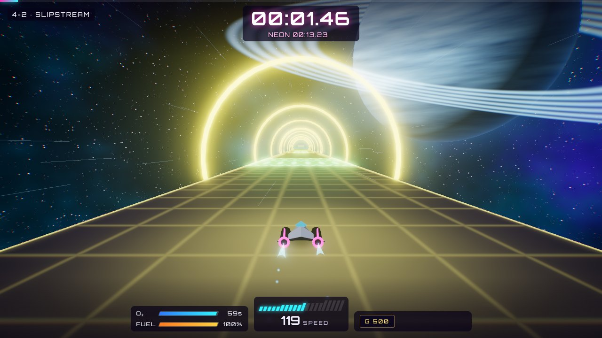 |
| **Solar Forge: the floor is literally lava** | **Ion Drift: ice, boost and no brakes** |
| 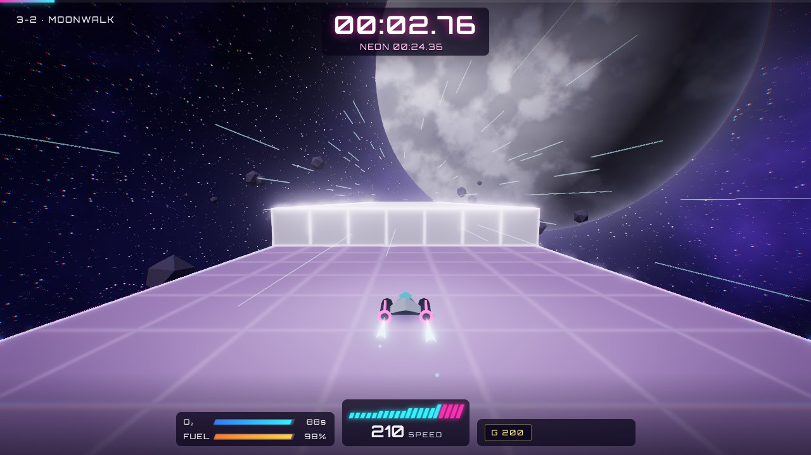 | 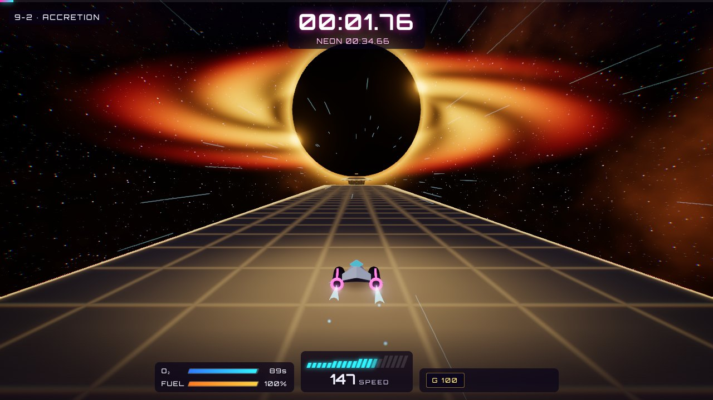 |
| **Glass Moon: low gravity, long falls** | **Event Horizon: gravity stops making sense** |
| 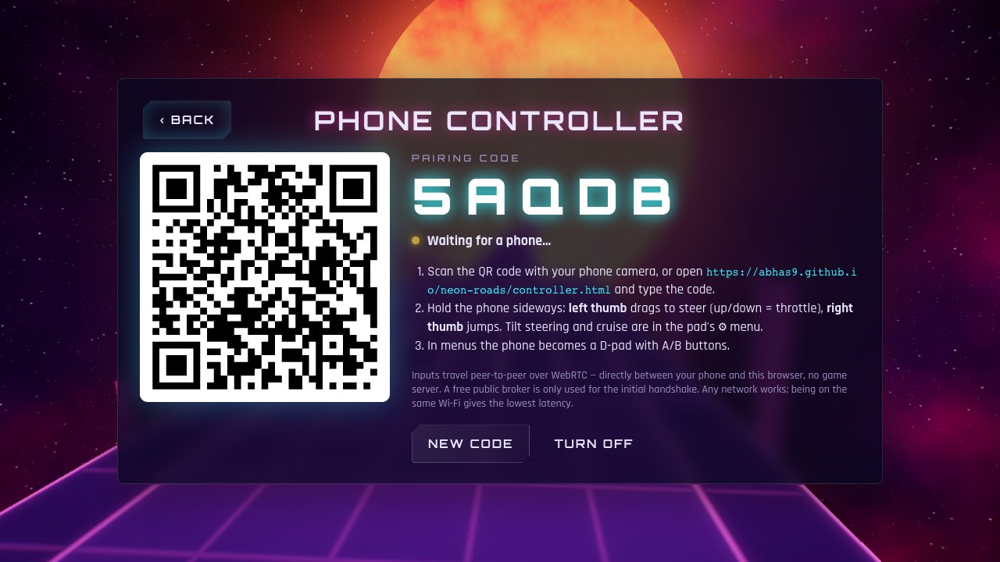 | 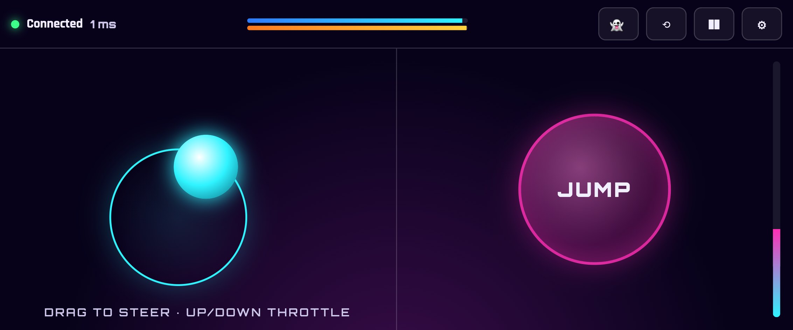 |
| **Pair a phone with a QR code** | **The phone becomes the gamepad** |
| 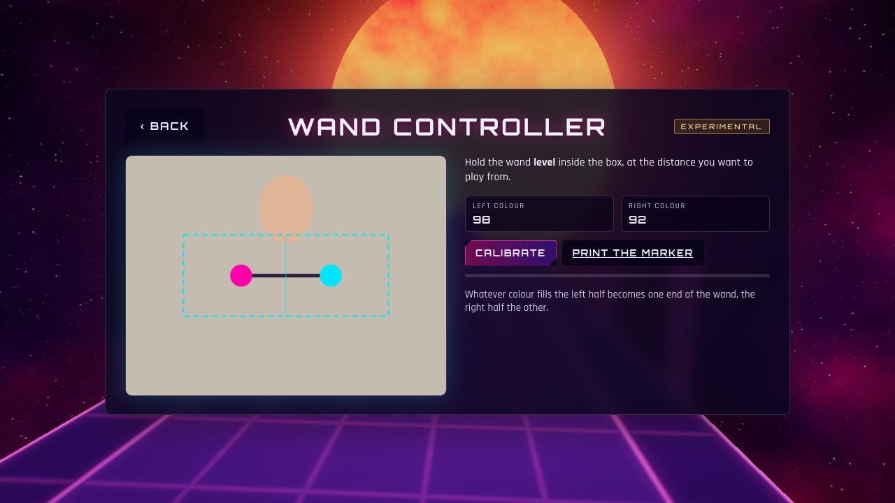 | 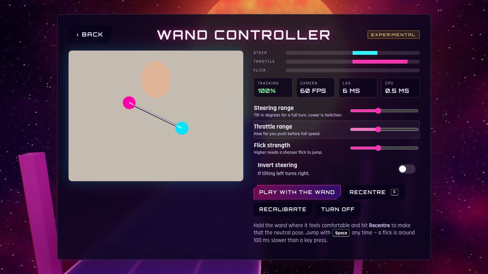 |
| **Calibrate a paper wand on camera** | **Live axes, tracking and latency readouts** |

<p align="center">
  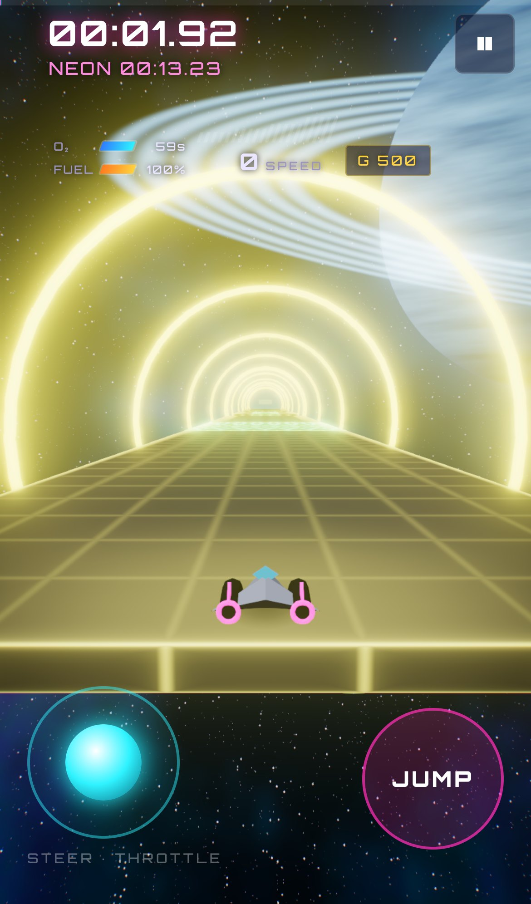
</p>

## How to play

Reach the glowing gate at the end of each road before your oxygen or fuel runs out.

| Action | Keyboard | Gamepad | Touch / phone |
|---|---|---|---|
| Steer | `←` `→` or `A` `D` | Left stick / D-pad | Drag the pad left or right (or tilt) |
| Accelerate / brake | `↑` `↓` or `W` `S` | RT / LT | Drag the pad up or down (or cruise) |
| Jump | `Space` | A | **JUMP** |
| Restart | `R` | Y / Back | ⟲ |
| Pause | `Esc` / `P` | Start | ❚❚ |
| Toggle holographic ghost | `G` | X | 👻 |
| Recentre the wand | `C` | — | — |

**Tips**

- Brushing a wall slowly only bumps you. Hitting one head-on at speed does not.
- Jump height depends on gravity (the **G** readout). At G 1700 you can barely hop.
- Boost pads let you carry extra speed into a jump. Some gaps need it.
- Sticky tar is survivable: keep the throttle down and you will crawl out.
- Turn on **Jump assist** in Settings while learning a road.

**Unlocking:** finish a road to unlock the next one in its world. Finish any two roads in a world to open the next world.

## Holographic ghost ship

Every road remembers your fastest run.

**Recording**
- The first time you clear a road, and every time you beat your best time, the game saves that run.
- It's stored as a compact input recording in your browser's local storage. No account or server is involved.
- Daily Runs keep a ghost of your furthest run for that day.

**The race**
- The next time you play the road, a cyan hologram of that run launches alongside you.
- It has scanlines, a glowing rim, flicker, occasional glitch jitter and wireframe edges.
- A floating label shows the time you're chasing.

**Reading it**
- The HUD shows your gap to the ghost in seconds (green when you're ahead, red when behind).
- The progress bar marks where the ghost is.
- The hologram fades when it overlaps your ship, so it never hides the road in front of you.

**Why it's exact.** The simulation is fully deterministic at 120 Hz, so the ghost replays your inputs frame-perfectly. The jump-assist setting you used is saved with the run, so assisted runs replay exactly too.

**Toggling.** Press `G` during a run, use the pause menu or Settings, or tap 👻 on the phone controller. The choice is remembered.

## Victory celebration and Share on X

**Fireworks.** Clear any campaign road and fireworks go up over the finish gate as the camera circles it. Rockets burst into peony, ring, willow and crackle patterns in the world's colours. A medal adds a finale salvo. The fireworks keep going behind the results screen, which shows your medal, time, remaining fuel and oxygen, top speed and jumps.

**Sharing.** Press **Share on X** on the results screen. This also works for Endless and Daily results.

1. **Copies an ASCII scorecard** to your clipboard, ready to paste anywhere:

   ```text
   +--------------------------------------+
   |  N E O N   R O A D S                 |
   |  ROAD  1-1  FIRST LIGHT              |
   |  WORLD LAUNCH RING                   |
   +--------------------------------------+
   |  TIME       00:20.38   NEON          |
   |  PAR        00:20.38   +0.00s        |
   |  FUEL       [###############-]  94%  |
   |  OXYGEN     [###############-]  96%  |
   |  TOP SPEED  210                      |
   |  JUMPS      7                        |
   |  ATTEMPTS   1                        |
   +--------------------------------------+
     Race me: https://abhas9.github.io/neon-roads/
   ```

2. **Opens a pre-filled post on X** with your road, time, medal, fuel and O₂ meters, top speed and a link to the game:

   ```text
   🏁 Cleared 1-1 "First Light" in NEON ROADS

   ⏱ 00:20.38 · 💎 NEON
   ⛽ Fuel ▰▰▰▰▰▰▰▰▰▱ 94%
   💨 O₂   ▰▰▰▰▰▰▰▰▰▰ 96%
   🚀 Top speed 210 · 7 jumps

   Can you beat my time?
   https://abhas9.github.io/neon-roads/
   ```

The post is kept within X's 280-character limit. When you play on a local dev server, the shared link points to the public site. On a fork deployed to GitHub Pages, it points to that fork.

## Use your phone as a controller

Works on the hosted site and locally.

1. Open the game on a computer and choose **Phone Controller** on the title screen.
2. Scan the QR code with your phone's camera, or open [`abhas9.github.io/neon-roads/controller.html`](https://abhas9.github.io/neon-roads/controller.html) on the phone and enter the five-letter code.
3. Hold the phone sideways:
   - **Left thumb:** drag to steer; up and down is throttle.
   - **Right thumb:** jump.
   - **In menus:** the phone becomes a D-pad with A/B buttons.

**On the pad:** tap 👻 to toggle the ghost. The ⚙ menu has tilt-to-steer, cruise (auto-accelerate), vibration and steering sensitivity. The phone also shows your oxygen, fuel and speed, and it vibrates on jumps, boosts and crashes.

### How it works

- **No game server:** the two browsers talk directly using WebRTC data channels via [PeerJS](https://peerjs.com).
  - The free public PeerJS broker is used only for the initial handshake.
  - After that, every input goes straight from your phone to the game.
  - On the same Wi-Fi, that is a local connection with a few milliseconds of latency.
  - On different networks, it still connects through STUN, or a public relay if it has to.
- **Low latency:**
  - Steering and throttle are sent as tiny 6-byte binary frames on an unordered channel, on every change plus a 30 Hz heartbeat.
  - Buttons, menu navigation, haptics and the mini HUD use a separate reliable channel.
- **Safe if the phone drops:** if a phone disconnects, its inputs are zeroed after 400 ms and the pad reconnects automatically.

### Troubleshooting

- **"No game found for code…"**: keep the pairing screen open on the computer, or press *New code* and scan again.
- **Tilt steering is unavailable on iPhone:** iOS only allows motion sensors on HTTPS pages. It works on the hosted site; on a local HTTP dev server, use touch steering.
- **Local dev server:** run `npm run dev` and make sure the phone is on the same Wi-Fi. The QR code automatically points at your computer's LAN address.
- **Use your own broker:** to avoid the public PeerJS broker, run a [PeerServer](https://github.com/peers/peerjs-server) and build with `VITE_PEER_HOST`, `VITE_PEER_PORT`, `VITE_PEER_PATH` and `VITE_PEER_SECURE`. In GitHub Actions you can set these as repository variables.
- **Verbose connection logs:** add `?peerdebug` to either page's URL.

## Wand controller: steer with a webcam

> **Experimental.** It is a genuinely fun way to play and a poor way to set records. See [the honest limitations](#what-it-is-good-at-and-what-it-is-not) below.

Print a two-colour marker, tape it to a pen, and fly the ship by waving it at your webcam.

<p align="center">
  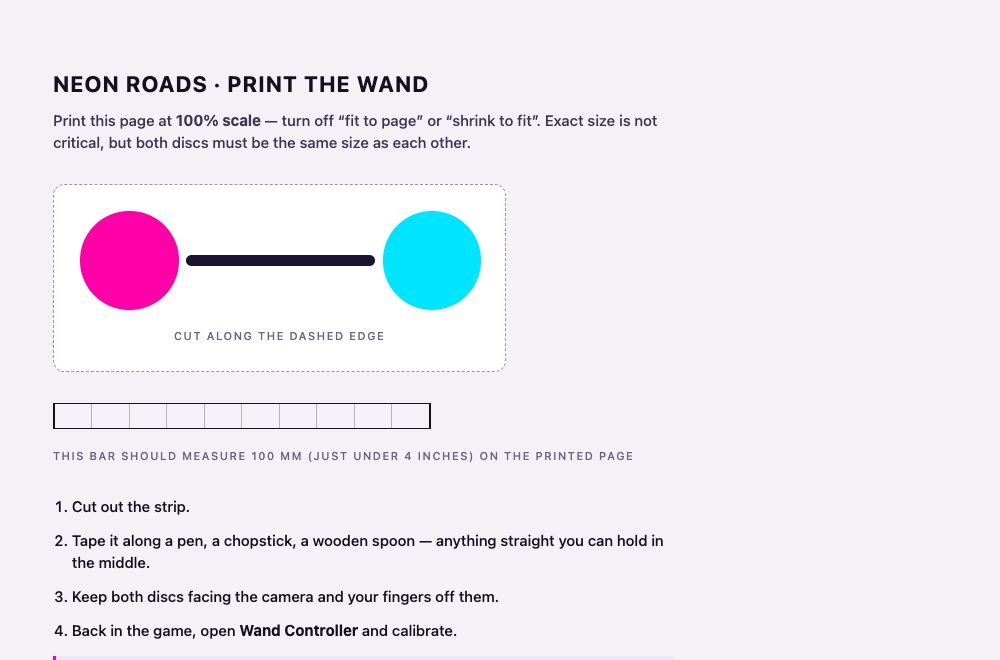
</p>

| Gesture | Control |
|---|---|
| **Tilt** the wand like a steering wheel | Steer |
| **Push** it towards the camera / **pull** it back | Accelerate / brake |
| **Flick** it upwards | Jump |
| `C`, or the **Recentre** button | Make the pose you are holding the new neutral |

### Getting started

1. Open **Wand Controller** on the title screen and hit **Print the marker** (or open [the marker sheet](https://abhas9.github.io/neon-roads/marker.html) directly). Print at 100% scale.
2. Cut out the strip and tape it along a pen, a chopstick, a wooden spoon — anything straight you can hold in the middle.
3. Back in the game, press **Enable camera** and allow access.
4. Hold the wand level inside the dashed box and press **Calibrate**. Sampling takes about half a second.
5. Tune steering range, throttle range and flick strength to taste, then **Play with the wand**.

**No printer?** You do not need one. Calibration samples whatever you hold up, so two clearly different coloured objects on a stick work just as well — a green and an orange bottle cap, two sticky notes, two sweet wrappers. Avoid anything close to skin, wood or wall tones.

**Your video never leaves your device.** Frames are processed in the page, nothing is recorded, and nothing is uploaded. Turning the wand off releases the camera.

### How it works

- **Two discs, not one.** The distance between the two centroids is a far steadier depth signal than one blob's area, which swings with partial occlusion and motion blur. The angle between them gives tilt for free.
- **Tilt for steering, not hand position.** Tilting is wrist-only, so it is much less tiring than sweeping your arm, and a wand has a physical detent — you can feel level, and return to neutral without watching the screen.
- **Normalised rg chromaticity, not hue.** Dividing out intensity means shading across the disc, a dimmed lamp or a cloud passing the window does not move a pixel out of its colour model. A fixed hue band falls apart under tungsten light or a backlit window.
- **Calibrated, not hard-coded.** Whatever fills the left half of the box becomes one end of the wand and the right half the other, fitted as a Gaussian in chroma space. That is what makes home-printer ink, and improvised objects, work.
- **Gated search.** Once locked, only a window around the previous frame is scanned. That is faster and stops a magenta cushion across the room from stealing the track; a miss falls back to a full-frame re-acquire.
- **1€ filter.** Steering and throttle are smoothed by a [1€ filter](https://gery.casiez.net/1euro/), whose cutoff rises with speed: no jitter while you hold still, no lag when you move. The flick signal is deliberately left unfiltered.
- **Cheap.** Tracking runs at 160x120 and costs about **0.4 ms per frame**, so it sits comfortably beside the bloom pipeline.
- **Safe when it loses you.** Controls fade to neutral within 200 ms, and the run auto-pauses after half a second. Without that, reaching for a drink means the ship holds its heading into a wall — and campaign mode restarts instantly, over and over.

### What it is good at, and what it is not

Camera control costs roughly **100 ms of jump latency** you do not pay with a key: a webcam frame is already tens of milliseconds old when it arrives, and a flick must be seen before it can be recognised. At full speed a road row passes every 48 ms, so late worlds with tight jump timing are genuinely harder this way.

So the wand is built to be played **alongside** the keyboard, not instead of it. Steering and throttle come from the wand while `Space` still jumps, and the pad and gamepad stay live too. Runs driven by the wand are tagged 🪄 on the shared scorecard.

The setup screen shows tracking lock, camera frame rate, pipeline lag and CPU cost live, because how well this works depends entirely on the room you are in. If tracking sits below 90%, add light or pick more saturated colours.

### Troubleshooting

- **"Could not see the first/second disc":** more light, hold the wand closer, or keep the whole marker inside the box.
- **"Both ends look like the same colour":** the two ends must be clearly different — not two shades of the same colour.
- **Steering feels backwards:** turn on **Invert steering**, or recalibrate holding the wand the other way round.
- **Drifting neutral:** hold the wand where it is comfortable and press `C`.
- **Camera blocked:** allow camera access from the address bar, then press **Try again**.
- **Jumps feel unreliable:** check the **Camera** readout. Tracking runs on `requestVideoFrameCallback`, so it follows the page's frame rate — below about 20 fps a flick can fall between two samples. Lower the graphics quality in Settings.
- **Requires HTTPS:** browsers only grant camera access on secure origins. The hosted site and `localhost` are fine; a plain-HTTP LAN address is not.

## Run locally

Requires Node.js 20.19+ or 22.12+.

```bash
git clone git@github.com:abhas9/neon-roads.git
cd neon-roads
npm install
npm run dev       # http://localhost:5287, also reachable from your LAN for the phone controller
```

| Command | What it does |
|---|---|
| `npm run dev` | Development server with hot reload |
| `npm test` | Unit tests: physics, road format, replay determinism, solver |
| `npm run build` | Type-check and build the static site into `dist/` |
| `npm run preview` | Serve the production build locally |

## Deploy to GitHub Pages

This repository deploys itself. [`.github/workflows/deploy.yml`](.github/workflows/deploy.yml) installs dependencies, runs the tests, builds, and publishes `dist/` to GitHub Pages on every push to `main`. Pull requests run the tests and build without deploying.

To deploy your own fork:

1. Fork the repository.
2. In **Settings → Pages**, set **Source** to **GitHub Actions**.
3. Push to `main`, or run the workflow manually from the **Actions** tab.

The build uses relative asset paths, so it works under any sub-path such as `https://<user>.github.io/<repo>/` with no configuration. The phone controller page is published next to the game at `controller.html`.

## Project structure

```
src/
  sim/          Deterministic physics (no three.js): grid collision, ship, replay tapes, beam-search solver
  levels/       Road text format, 10 worlds / 30 roads, par times, endless and daily generator
  render/       Road chunk meshes with a neon shader, sky shader, ship model, hologram ghost, fireworks, particles, camera, post-processing
  game/         Run session (fixed-step loop, ghosts, death/finish flow), medals, scorecard and X post builder
  ui/           HUD, menu screens, on-screen touch controls
  net/          Phone-controller wire protocol and WebRTC host
  wand/         Camera wand: colour-blob tracker, calibration, 1 euro filter and flick detector, pose mapping, camera runtime
  controller/   The phone controller page
  audio/        Synthesized sound effects and the procedural music sequencer
tests/          Vitest unit tests
tools/          Solver scripts and Playwright checks (screenshots, real-GPU render check, phone and wand end-to-end, contrast audit, synthetic webcam)
docs/           Design research and plan, screenshots
```

## Authoring roads

Roads are plain text, one row per line, starting from the beginning of the road:

```text
=======*30     30 rows of full-width floor
..===..*10     narrow to three lanes
.......*4      a four-row gap
HHHTHHH*14     a wall of full blocks with a tunnel through the middle
{
x=x=x=x
=======
}*6            repeat a group of rows
```

| Symbol | Cell | Symbol | Cell |
|---|---|---|---|
| `.` | gap | `h` / `H` | half / full block |
| `=` `-` `:` | floor (three shades) | `g` / `G` | half / full block, alternate colour |
| `s` | supply | `t` | tunnel |
| `b` | boost | `T` | tunnel through a full block |
| `k` | sticky | `X` / `S` / `B` | half block with burning / supply / boost top |
| `i` | slippery | `x` | burning |

The roads live in [`src/levels/roads/`](src/levels/roads). After editing, run `npm run solve`. It proves every road can be finished without jump assist and writes the par times used for medals to `src/levels/pars.json`. Pass a prefix to check only some roads, e.g. `npm run solve -- w3`.

## Testing and verification

| Command | Checks |
|---|---|
| `npm test` | Physics, collisions, tiles, gravity, boost, replay encoding determinism, solver, and the wand tracker/filter/mapper against synthetic camera frames |
| `npm run solve` | All 30 roads are beatable; updates par times |
| `npm run solve:endless` | Windows of generated endless roads at several difficulty depths are beatable |
| `npm run check:gpu` | Renders several worlds in installed Chrome on the real GPU and fails on black-outs or invalid bloom output (dev server must be running) |
| `npm run e2e:phone` | Pairs a phone page with the game over real WebRTC, navigates menus and drives the ship (dev server must be running) |
| `npm run e2e:wand` | Drives the camera wand end to end with a synthetic webcam (`canvas.captureStream` behind a stubbed `getUserMedia`): calibration, all three axes, the flick-to-jump gesture, steering the real ship, auto-pause on tracking loss, and calibration surviving a reload (dev server must be running) |
| `npm run e2e:celebrate` | Finishes a road by replaying a solver run. Checks the fireworks, the results screen, the Share on X link and clipboard scorecard, the saved ghost, and that `G` toggles the hologram (dev server must be running) |
| `npm run audit:contrast` | WCAG contrast audit of every visible text on 34 screens (menus, HUD over six worlds, results, mobile, phone controller, wand setup). It measures each text box against what is actually rendered behind it, including the 3D scene, and fails below AA (4.5:1, or 3:1 for large text). Needs the dev server running |
| `npm run shots -- <dir>` | Screenshots of every world and the mobile layout |

The Playwright checks use an installed Google Chrome. Software-rendered headless browsers can miss GPU driver bugs, and some operating-system firewalls block peer-to-peer traffic for Playwright's bundled Chromium.

## Credits

**Inspiration**

- *SkyRoads* (1993) and *Kosmonaut* (1990) by **BlueMoon Software**. Thank you for the game that started it all.
- Research into the original's mechanics drew on the [SkyRoads Wikipedia article](https://en.wikipedia.org/wiki/SkyRoads_(video_game)), [MobyGames](https://www.mobygames.com/game/1007/skyroads/), the [ModdingWiki level format notes](https://moddingwiki.shikadi.net/wiki/SkyRoads_level_format), retro reviews, and a full playthrough recording by AndokaiCamanis.

**Open-source software and assets**

| Project | Used for | License |
|---|---|---|
| [three.js](https://threejs.org) | 3D rendering and post-processing | MIT |
| [PeerJS](https://peerjs.com) | WebRTC connections for the phone controller | MIT |
| [qrcode-generator](https://github.com/kazuhikoarase/qrcode-generator) | Pairing QR codes | MIT |
| [Orbitron](https://fonts.google.com/specimen/Orbitron) and [Rajdhani](https://fonts.google.com/specimen/Rajdhani) via Google Fonts | Typography | SIL Open Font License 1.1 |
| [Vite](https://vite.dev), [Vitest](https://vitest.dev), [TypeScript](https://www.typescriptlang.org), [Playwright](https://playwright.dev) | Build, tests and verification tooling | MIT / Apache-2.0 |

## License

Neon Roads is released under the [MIT License](LICENSE). Copyright (c) 2026 Abhas Tandon.

The MIT license covers the code and original content in this repository. It does not cover the SkyRoads or Kosmonaut names or games, which belong to their respective owners.
